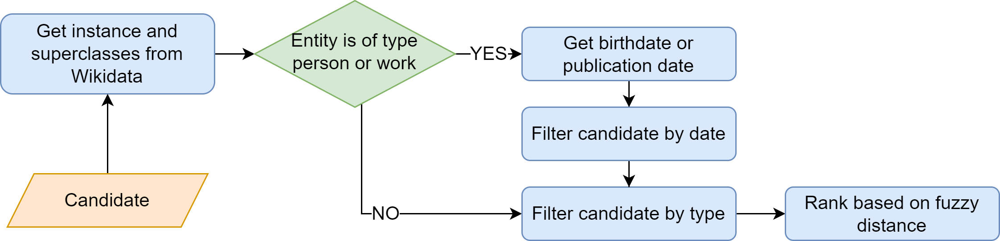

## Extract Silver Annotations for Entity Linking from DigitalZibaldone

This repository contains data and source code used to extract silver annotations from the [DigitalZibaldone](https://digitalzibaldone.net/), a web platform that contains an XML/TEI editions of Giacomo Leopardi's *Zibaldone 
di pensieri*.

This project develops a simple Web Scraping strategy were entity annotations are extracted from the links in each 
paragraph. As an example, places referenced in the Zibaldone are linked to Wikidata. 

```html
<p> 
<a href="https://www.wikidata.org/wiki/Q220">Rome</a> is the capital of <a href="https://www.wikidata.org/wiki/Q38">Italy</a>.
</p>
```
By applying this algorithm, we automatically collected **764 references to persons, locations and bibliographic works** 
from 260 paragraphs ([available here](data/annotations_23.csv)). 

## Named Entity Recognition Evaluation

Three Named Entity Recognition (NER) models were tested on the annotations of persons and locations from the aforementioned file:
* `stanzanlp/ner-it`: Transformer model trained on [KIND](https://github.com/dhfbk/KIND) (Paccosi & Aprosio, 2022)
* `nickprock/bert-italian-finetuned-ner`: Transformer Model trained on the Italian portion of [Wikiann](https://paperswithcode.com/dataset/wikiann-1) (Pan et al., 2017)
* `swap-uniba/LLaMAntino-2-13b-hf-evalita-ITA`: Encoder-Decoder LLM for Italian based on LLaMa 2 and trained via 
  Instruction-Tuning on [EVALITA2023](https://www.evalita.it/campaigns/evalita-2023/) (Basile et al., 2023)

|                                          | Precision | Recall    | F1        |
|------------------------------------------|-----------|-----------|-----------|
| `stanzanlp/ner-it`                       | 62.26     | **76.67** | 68.72     |
| `nickprock/bert-italian-finetuned-ner`      | **64.68** | 74.50     | **69.24** |
| `swap-uniba/LLaMAntino-2-13b-hf-evalita-ITA`      | 51.77     | 58.23     | 54.81     |


## Entity Linking Evaluation

For the Entity Linking experiments, we equipped the NER model from `stanzanlp` with a multilingual Entity 
Disambiguation model, namely [mGENRE](https://github.com/facebookresearch/GENRE) (De Cao et al., 2022).
In order to adapt our pipeline to Leopardi's text, we adopted a simple filtering strategy by **querying Wikidata**. 
A flowchart of the filtering algorithm is shown below. 




|                                                   | Precision | Recall | F1    |
|---------------------------------------------------|-----------|--------|-------|
| `stanzanlp/ner-it + mGENRE (baseline)`            | 46.7      | 57.92  | 51.71 |
| `stanzanlp/ner-it + mGENRE + filtering` | **58.13** | 42.99  | 49.42 |

By applying our filtering strategy, we drastically reduced the amount of false positives from 363 to 170 and we 
**successfully increased the precision** of the entity linker. However, 82 correct predictions were wrongly filtered in 
the process, reducing the recall of our approach. 

## References

* Basile, P., Musacchio, E., Polignano, M., Siciliani, L., Fiameni, G., & Semeraro, G. (2023). LLaMAntino: LLaMA 2 Models for Effective Text Generation in Italian Language (arXiv:2312.09993). arXiv. https://doi.org/10.48550/arXiv.2312.09993
* De Cao, N., Wu, L., Popat, K., Artetxe, M., Goyal, N., Plekhanov, M., Zettlemoyer, L., Cancedda, N., Riedel, S., & 
Petroni, F. (2022). Multilingual Autoregressive Entity Linking. Transactions of the Association for Computational Linguistics, 10, 274–290. https://doi.org/10.1162/tacl_a_00460
* Paccosi, T., & Palmero Aprosio, A. (2022). KIND: An Italian Multi-Domain Dataset for Named Entity Recognition. In N. Calzolari, F. Béchet, P. Blache, K. Choukri, C. Cieri, T. Declerck, S. Goggi, H. Isahara, B. Maegaard, J. Mariani, H. Mazo, J. Odijk, & S. Piperidis (A c. Di), Proceedings of the Thirteenth Language Resources and Evaluation Conference (pp. 501–507). European Language Resources Association. https://aclanthology.org/2022.lrec-1.52
* Pan, X., Zhang, B., May, J., Nothman, J., Knight, K., & Ji, H. (2017). Cross-lingual Name Tagging and Linking for 282 Languages. In R. Barzilay & M.-Y. Kan (A c. Di), Proceedings of the 55th Annual Meeting of the Association for Computational Linguistics (Volume 1: Long Papers) (pp. 1946–1958). Association for Computational Linguistics. https://doi.org/10.18653/v1/P17-1178
* Stoyanova, S. & Johnston, B. (Eds.), *Giacomo Leopardi's Zibaldone di pensieri: a digital research platform*. https://digitalzibaldone.net/